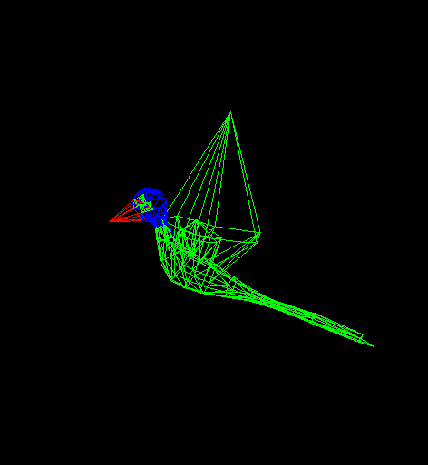

# Rasterizer_From_Scratch
 Watch Project Wiki to see Dev phases: https://github.com/rupak10987/Rasterizer_from_scratch/wiki
 
 An attempt to make a rasterizer rendering technique from scratch(C++). Graphics.h is used to utilize its putpixel(X,Y,COL) method only. No additional libray is used apart from basic ones(like math.h) which will also be discarded later.

